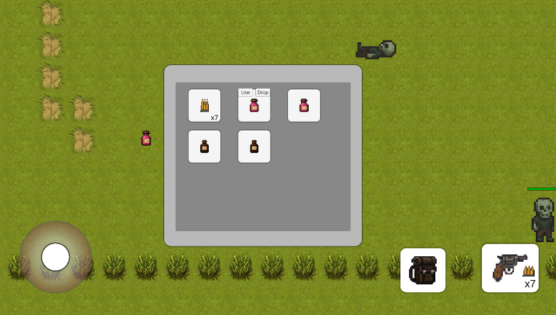

# Walker Game
> [🇷🇺 Read this in Russian (README_RU.MD)](README_RU.md)

[Android Apk Build](https://github.com/Ekcof/WalkerTest/blob/main/build.apk)

This game is a **top-down platformer** with continuous enemy spawning.  
The player controls a character using a virtual joystick on the screen and buttons on the bottom control panel.  
The player can damage enemies with a pistol that has limited range and requires ammo. When the player's health reaches 0%, there is a chance to...

## Project Features

This project is built around modularity and extensibility. Main highlights:

### Universal Movement Component

- **Movement** — a component managing movement for the player, mobs, and even the camera.
- Includes a stub for future NavMesh extension (not used yet, but prepared for scalability).

### Registries for Targets, Mobs, and Loot

- **Registry classes** allow fast access to any interactive object in the scene.
- You can easily fetch and find the nearest objects using the **Detector** component — works for both NPCs and the player.

### Inventory & Items System

- Components inheriting from `IInventory` allow you to create custom item storage for both player and mobs.
- Inventory window displays items visually in slots.
- Supports stackable items (e.g., ammo up to 100 per slot).

### Enemy Respawn

- **EnemySpawnManager** — a scalable and configurable component for continuous enemy spawning at specified points.
- You can set spawn intervals and corpse removal times.

### Pool Pattern Usage

- The **pool pattern** is used for efficient reuse of mobs and item objects on the scene.
- Greatly improves performance with many objects and long game sessions.

### PlayerLog

- UI component to display status or a history of recent player actions (e.g., picked-up items, detected nearby enemies, etc).

### Save System

- The `SerializationManager` handles save creation. Player progress and inventory are saved to a JSON file, which can be uploaded remotely via services like GamePush.

### Game State Machine

- Manages game states (loading, main, defeat, respawn, restart). This allows you to split the game's master logic into independent classes, reducing coupling and improving readability. UI updates automatically based on the game state. The system is extensible and lets you add new states with custom logic.

### Animation

- Includes a `SimpleAnimator` component for basic frame-by-frame animations with specified Id and FPS. Easy to use in code. Serves as an alternative to Unity's heavy Animator and extra files when not needed.
- Part of the animation atlas was generated with LLM ChatGPT 4.1.

## Third-party Frameworks

- [DOTween](https://dotween.demigiant.com/)
- [Modern Procedural UI](https://assetstore.unity.com/packages/tools/gui/modern-procedural-ui-kit-163041)
- [UniRx](https://github.com/neuecc/UniRx)
- [UniTask](https://github.com/Cysharp/UniTask)
- [Zenject](https://assetstore.unity.com/packages/tools/utilities/extenject-dependency-injection-ioc-157735)
